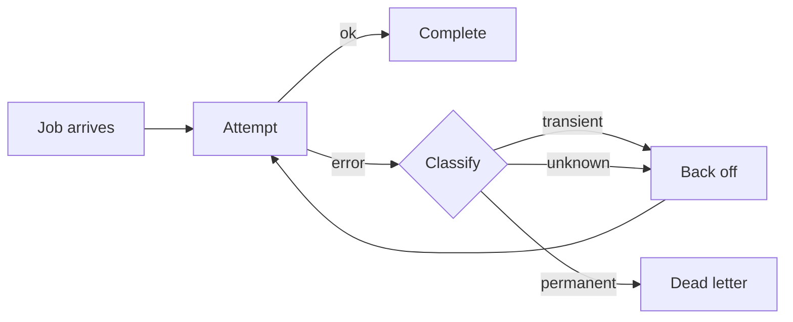

# Retry budget for the ingest pipeline

A short design note, written to be reviewed. Open it with
`plan-editor examples/retry-budget.md` — the file stays Markdown on disk; the
browser renders it, and your notes anchor to the rendered blocks.

## The problem

Ingest jobs fail for two unrelated reasons and we currently treat them the same.
Transient failures — a socket reset, a 503 from the object store — succeed on a
second attempt about 94% of the time. Permanent failures — a malformed payload,
a schema mismatch — never succeed, no matter how many times we try.

Retrying both classes identically means a poison payload burns the same budget
as a flaky socket, and the queue backs up behind work that can never complete.

## How a job flows today

The loop is the problem: `Classify` runs on every attempt rather than once, so a
payload that can never parse takes the same five trips through `Back off` as a
flaky socket.

## Proposal

Split the budget by failure class.

- **Transient** — up to 5 attempts, exponential backoff starting at 200ms with
  full jitter. Give up after 30 seconds of wall time regardless of attempt count.
- **Permanent** — no retries. Move straight to the dead-letter queue with the
  parse error attached.
- **Unknown** — treat as transient, but cap at 2 attempts. An unclassified
  failure is usually a bug in our classifier, and hammering it hides that.

Classification happens once, at the point of failure, and travels with the job.
Re-deriving it per attempt is how the current code ends up retrying a permanent
failure five times.

## What this costs

Roughly 12% more memory on the dead-letter queue, because permanent failures now
arrive there immediately instead of after five attempts spread over a minute.
That is the trade we want: the queue is cheap and the head-of-line blocking is
not.

## Open questions

### Should the wall-clock cap be per job or per batch?

Per job is simpler and is what this note assumes. Per batch bounds the worst case
better but needs a shared clock the workers do not currently have.

### What happens to jobs already in flight at deploy?

They keep the old budget until they drain. This is probably fine — the longest
observed job lifetime is under two minutes — but it does mean the two policies
coexist briefly.

## Risks

The classifier is the whole design. If it labels a transient failure as
permanent, we drop work that would have succeeded, and we drop it silently
because the dead-letter queue is not currently alerted on. Adding that alert is
a prerequisite, not a follow-up.
